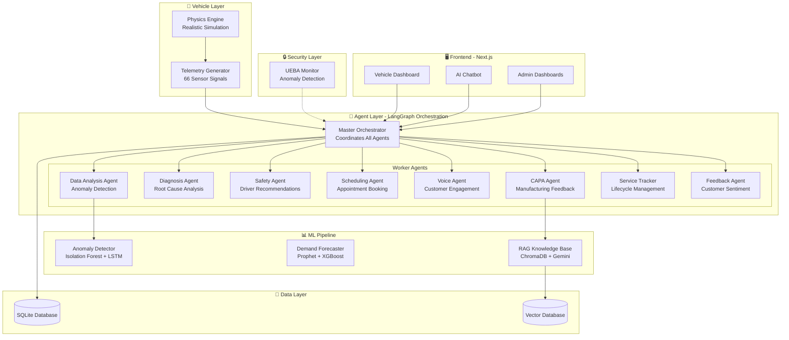
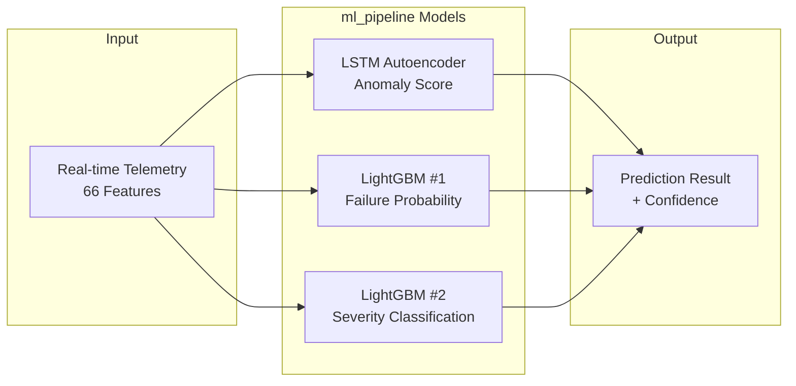

# SentinEV - EY Techathon 6.0 Complete Documentation

## 🎯 Executive Summary

**SentinEV** is an **Agentic AI Predictive Maintenance System** for Electric Vehicles that uses a Master-Worker agent architecture built on **LangGraph** to autonomously monitor vehicles, predict failures, engage customers via voice, and optimize service operations.

---

## 📋 Table of Contents

1. [System Architecture](#system-architecture)
2. [Agent Hierarchy](#agent-hierarchy)
3. [Data Flow & Workflow](#data-flow--workflow)
4. [File Structure Explained](#file-structure-explained)
5. [Evaluation Criteria Mapping](#evaluation-criteria-mapping)
6. [Demo Script for Judges](#demo-script-for-judges)

---

## 🏗️ System Architecture



---

## 👥 Agent Hierarchy

### Master Agent: `MasterOrchestrator` (1981 lines)

**File:** `agents/orchestrator.py`

The brain of SentinEV. Built on **LangGraph** with state machine transitions:

| Responsibility                        | Implementation                                                              |
| ------------------------------------- | --------------------------------------------------------------------------- |
| Route telemetry to appropriate worker | Hash-based routing for load balancing                                       |
| Severity-based decision making        | Critical → Voice + Towing, High → Voice booking, Medium → Push notification |
| Coordinate multi-agent workflows      | Sequential: Data → Diagnosis → Safety → Scheduling                          |
| Chat conversation handling            | Intent detection + context-aware responses                                  |
| UEBA integration                      | All agent actions monitored                                                 |

### Worker Agents

| Agent               | File                       | Lines | Purpose                                         |
| ------------------- | -------------------------- | ----- | ----------------------------------------------- |
| **Data Analysis**   | `data_analysis_agent.py`   | 400   | Processes telemetry, detects anomalies using ML |
| **Diagnosis**       | `diagnosis_agent.py`       | 550   | Root cause analysis with LLM reasoning          |
| **Safety**          | `safety_agent.py`          | 300   | Generates driver safety recommendations         |
| **Scheduling**      | `scheduling_agent.py`      | 1046  | Manages appointments, labor optimization        |
| **Voice**           | `voice_agent.py`           | 1016  | Web Speech API + Emotion detection              |
| **CAPA**            | `capa_agent.py`            | 911   | RCA/CAPA manufacturing feedback loop            |
| **Service Tracker** | `service_tracker_agent.py` | 357   | Amazon-style service lifecycle tracking         |
| **Feedback**        | `feedback_agent.py`        | 900   | NPS scoring, sentiment analysis                 |

---

## 🔄 Data Flow & Workflow

### End-to-End Flow: Anomaly Detection → Service Completion

```
1. TELEMETRY GENERATION
   └── Physics Engine generates 66 realistic sensor signals every second

2. REAL-TIME ANALYSIS
   └── Data Analysis Agent runs ML pipeline:
       ├── Isolation Forest (anomaly detection)
       ├── LSTM (time-series prediction)
       └── RandomForest (severity classification)

3. SEVERITY-BASED ROUTING (Master Orchestrator)
   ├── CRITICAL (>80% failure risk)
   │   ├── Immediate Voice Call (Voice Agent)
   │   ├── Dispatch Towing (Scheduling Agent)
   │   └── Generate CAPA Report (CAPA Agent)
   │
   ├── HIGH (60-80% failure risk)
   │   ├── Voice Call with booking offer
   │   └── Push notification to app
   │
   ├── MEDIUM (40-60% failure risk)
   │   ├── Chatbot recommendation
   │   └── Scheduled follow-up
   │
   └── LOW (<40% failure risk)
       └── Monitor only

4. CUSTOMER ENGAGEMENT
   ├── Voice Agent: Initiates call, explains issue, books appointment
   ├── Chatbot: Answers queries, negotiates slots, confirms booking
   └── Emotion Detection: Adapts tone based on user sentiment

5. SERVICE LIFECYCLE (Service Tracker Agent)
   └── INTAKE → DIAGNOSIS → WAITING_PARTS → REPAIR → QUALITY_CHECK → READY → PICKED_UP

6. FEEDBACK LOOP (CAPA Agent)
   └── Post-service: Generate RCA report → Pattern analysis → Manufacturing insights
```

### Chatbot Conversation Flow

```
User: "I need to schedule brake service"
    │
    ▼
[Intent Detection: scheduling_request]
    │
    ▼
Orchestrator → Scheduling Agent
    │
    ├── Check availability (Labor Forecaster)
    ├── Find optimal center (Geo-optimization)
    └── Generate LLM response with slots
    │
    ▼
AI: "I found 3 available slots at Downtown EV Hub..."
    │
    ▼
User: "Book the 2:30 PM slot"
    │
    ▼
[Intent Detection: confirm_booking]
    │
    ├── Create appointment in database
    ├── Create service ticket
    └── Send confirmation
    │
    ▼
AI: "Your appointment is confirmed for 2:30 PM..."
```

---

## 📁 File Structure Explained

### `/agents` - Multi-Agent System (LangGraph)

```
agents/
├── orchestrator.py       # Master Agent - LangGraph state machine, UEBA integration
├── data_analysis_agent.py # Telemetry analysis, ML pipeline integration
├── diagnosis_agent.py    # LLM-powered root cause analysis
├── safety_agent.py       # Driver safety recommendations
├── scheduling_agent.py   # Appointment booking, labor optimization
├── voice_agent.py        # Voice calls, Web Speech API, emotion detection
├── capa_agent.py         # RCA/CAPA manufacturing feedback
├── service_tracker_agent.py # Service lifecycle (Amazon-style tracking)
├── feedback_agent.py     # NPS, sentiment analysis, personalization
├── agent_state.py        # LangGraph state definitions
├── scheduling_utils.py   # Geo-optimization, demand forecasting helpers
├── capa_utils.py         # Supplier risk, model year drift analysis
└── voice_personas.py     # Scenario scripts, emotion handling
```

### `/ml` - Machine Learning Pipeline

```
ml/
├── enhanced_api.py       # FastAPI backend (3291 lines, 150+ endpoints)
├── anomaly_detector.py   # IsolationForest + LSTM + RandomForest ensemble
├── telemetry_generator.py # 66-feature realistic EV data generation
├── physics.py            # Physics-based vehicle simulation
├── scenarios.py          # Test scenarios (brake_fade, battery_critical, etc.)
├── demand_forecasting.py # Prophet-based demand prediction
├── labor_forecasting.py  # Technician assignment optimization
├── rag_knowledge.py      # ChromaDB vector store + Gemini LLM
├── fleet_manager.py      # Multi-vehicle fleet coordination
├── threshold_adapter.py  # Dynamic threshold adjustment
├── digital_twin_model.py # Digital twin simulation
└── model_loader.py       # Pre-trained model persistence
```

### `/db` - Database Layer

```
db/
├── database.py           # SQLite with 15+ tables (appointments, tickets, CAPA)
├── monitoring.py         # Real-time metrics, Prometheus-style
└── monitoring_utils.py   # Anomaly pattern detection
```

### `/frontend` - Next.js Dashboard

```
frontend/src/
├── app/
│   ├── page.tsx              # Fleet overview dashboard
│   ├── vehicles/[vin]/       # Real-time vehicle monitoring
│   │   ├── page.tsx          # Telemetry + ML predictions
│   │   └── tracking/page.tsx # Service lifecycle tracking
│   ├── chat/[vin]/page.tsx   # AI chatbot interface
│   ├── admin/
│   │   ├── scheduler/        # Appointment calendar (Tetris-style)
│   │   ├── service-center/   # Service workflow management
│   │   ├── capa/             # RCA/CAPA manufacturing dashboard
│   │   └── security/         # UEBA monitoring dashboard
│   └── service-center/       # Service center operations
├── components/
│   ├── ui/
│   │   ├── VoiceCallModal.tsx    # Voice call simulation
│   │   ├── CriticalAlertModal.tsx # Emergency alerts
│   │   ├── TetrisCalendar.tsx    # Visual scheduling
│   │   └── AgentConsoleLog.tsx   # Real-time agent activity
│   └── layout/
│       ├── Sidebar.tsx       # Navigation
│       └── Navbar.tsx        # Status indicators
├── hooks/
│   └── useWebSocket.ts      # Real-time telemetry streaming
└── stores/
    ├── telemetryStore.ts     # Zustand state management
    └── vehicleStore.ts       # Vehicle state
```

### `/data` - Data Layer

```
data/
├── datasets/
│   ├── capa_records.json     # Historical RCA/CAPA data
│   └── service_centers.json  # Center locations, capacity
├── ml_vectordb/              # ChromaDB embeddings for RAG
├── models/                   # Pre-trained ML models
└── sentinev.db               # SQLite database
```

### `/ml_pipeline` - ML Model Training & Deployment ⭐

This is the core ML infrastructure with **3 pre-trained models** for production-grade anomaly detection.

```
ml_pipeline/
├── models/                          # Pre-trained production models
│   ├── lstm_ae_best.pt              # LSTM Autoencoder (436KB) - Anomaly detection
│   ├── lgbm_failure_predictor.txt   # LightGBM - Failure probability
│   ├── lgbm_severity_classifier.txt # LightGBM - Severity classification
│   ├── lstm_ae_config.json          # LSTM architecture config
│   ├── feature_columns.json         # 66 feature column names
│   ├── thresholds.json              # Anomaly thresholds
│   └── *_metrics.json               # Training metrics
│
├── scripts/                         # Model training scripts
│   ├── train_lstm_ae.py             # Train LSTM Autoencoder
│   ├── train_lgbm.py                # Train LightGBM models
│   ├── generate_synthetic.py        # Generate synthetic training data
│   ├── preprocessing.py             # Feature engineering
│   └── evaluate_models.py           # Model evaluation
│
├── datasets/                        # Training datasets (14 files)
├── synthetic_data/                  # Generated synthetic data (11 files)
├── config.json                      # Pipeline configuration
├── telemetry_schema.json            # 66-feature schema definition
├── evaluation_metrics.txt           # Success criteria & targets
└── labeling_spec.md                 # Data labeling specification
```

---

## 🤖 ML Pipeline Deep Dive

### Three-Model Ensemble Architecture



### Model Details

| Model                   | Type     | Architecture         | Purpose                                   | Output                   |
| ----------------------- | -------- | -------------------- | ----------------------------------------- | ------------------------ |
| **LSTM Autoencoder**    | PyTorch  | 64→32→16 latent dims | Detect anomalies via reconstruction error | Anomaly score (0.0-1.0)  |
| **Failure Predictor**   | LightGBM | Gradient boosting    | Predict failure probability               | Probability (0-100%)     |
| **Severity Classifier** | LightGBM | Multi-class          | Classify severity level                   | low/medium/high/critical |

### Training Process

```python
# 1. Generate synthetic training data
python ml_pipeline/scripts/generate_synthetic.py
# → Creates 10 vehicles × 90 days of telemetry with injected faults

# 2. Train LSTM Autoencoder
python ml_pipeline/scripts/train_lstm_ae.py
# → Learns normal patterns, outputs reconstruction error for anomalies

# 3. Train LightGBM models
python ml_pipeline/scripts/train_lgbm.py
# → Failure prediction + severity classification

# 4. Evaluate models
python ml_pipeline/scripts/evaluate_models.py
# → Generates metrics against success criteria
```

### Model Loader Integration

The `ModelLoader` singleton (`ml/model_loader.py`) connects pre-trained models to the live system:

```python
# ml/model_loader.py - Singleton loader for ml_pipeline models
class ModelLoader:
    """Loads LSTM-AE, LightGBM failure predictor, and severity classifier."""

    def _load_all_models(self):
        # Load LSTM Autoencoder from ml_pipeline/models/lstm_ae_best.pt
        self.models.lstm_autoencoder = load_pytorch_model(...)

        # Load LightGBM from ml_pipeline/models/lgbm_failure_predictor.txt
        self.models.failure_predictor = lgb.Booster(model_file=...)

        # Load LightGBM from ml_pipeline/models/lgbm_severity_classifier.txt
        self.models.severity_classifier = lgb.Booster(model_file=...)

    def predict_failure(self, features) -> Tuple[float, bool]:
        """Predict failure probability using LightGBM."""
        prob = self.failure_predictor.predict(features)
        return prob, prob > self.thresholds['failure']

    def compute_anomaly_score(self, sequence) -> float:
        """Compute reconstruction error using LSTM-AE."""
        reconstruction = self.lstm_autoencoder(sequence)
        return mse(sequence, reconstruction)
```

### Usage in Anomaly Detector

The `AdvancedAnomalyDetector` (`ml/anomaly_detector.py`) uses these models:

```python
# ml/anomaly_detector.py - Uses ml_pipeline models for production detection
class AdvancedAnomalyDetector:
    def __init__(self, vehicle_id):
        self.model_loader = get_model_loader()  # Singleton

    def predict(self, telemetry):
        features = self._prepare_features(telemetry)  # 66 aggregate features

        # 1. LSTM-AE anomaly detection
        anomaly_score = self.model_loader.compute_anomaly_score(features)
        is_anomaly = self.model_loader.is_anomaly(anomaly_score)

        # 2. LightGBM failure prediction
        failure_prob, _ = self.model_loader.predict_failure(features)

        # 3. LightGBM severity classification
        severity = self.model_loader.predict_severity(features)

        return AnomalyResult(
            is_anomaly=is_anomaly,
            anomaly_score=anomaly_score,
            failure_risk_pct=failure_prob * 100,
            severity=severity
        )
```

### Evaluation Metrics & Targets

| Model                   | Metric                | Target   | Notes                         |
| ----------------------- | --------------------- | -------- | ----------------------------- |
| **Failure Predictor**   | AUC-ROC               | ≥ 0.75   | Binary classification quality |
|                         | Precision@100         | ≥ 0.70   | Top 100 highest-risk windows  |
|                         | Median Lead Time      | ≥ 7 days | Early warning capability      |
| **Anomaly Detector**    | Precision             | ≥ 0.80   | True positive rate            |
|                         | False Positives/1000h | < 5      | Minimize alert fatigue        |
|                         | Detection Latency     | < 60 sec | Real-time responsiveness      |
| **Severity Classifier** | Macro F1              | ≥ 0.70   | Balanced across classes       |
|                         | Critical Recall       | ≥ 0.80   | Safety-critical detection     |

---

## ✅ Evaluation Criteria Mapping

### Technical Design (40%) ✓

| Requirement                      | Implementation                                                                           |
| -------------------------------- | ---------------------------------------------------------------------------------------- |
| **Agentic AI Framework**         | LangGraph with StateGraph, conditional routing, checkpointing                            |
| **Master + Worker Architecture** | MasterOrchestrator + 8 specialized worker agents                                         |
| **UEBA Security**                | UEBAMonitor class in orchestrator - logs actions, detects anomalies, blocks unauthorized |
| **Autonomous Operation**         | Severity-based auto-routing (critical → voice call, high → notification)                 |

**Key Files:**

- `agents/orchestrator.py:157-256` - UEBAMonitor implementation
- `agents/orchestrator.py:259-1919` - MasterOrchestrator with LangGraph

### Realism of Data (25%) ✓

| Requirement                   | Implementation                                              |
| ----------------------------- | ----------------------------------------------------------- |
| **Synthetic Telematics**      | 66 sensor signals with physics-based generation             |
| **Realistic Failure Models**  | 3-model ensemble: LSTM-AE + LightGBM predictor + classifier |
| **Simulated Scheduling APIs** | Labor forecasting, geo-optimization, parts inventory        |
| **Pre-trained Models**        | ml_pipeline with trained LSTM-AE and LightGBM models        |

**Key Files:**

- `ml_pipeline/models/` - Pre-trained LSTM-AE, LightGBM models
- `ml/model_loader.py` - Singleton loader for ml_pipeline models
- `ml/anomaly_detector.py` - Uses models for real-time detection
- `ml/telemetry_generator.py` - 35KB of realistic EV physics
- `ml/physics.py` - Battery degradation, motor dynamics, brake wear

### Conversation Flow (25%) ✓

| Requirement                | Implementation                         |
| -------------------------- | -------------------------------------- |
| **Natural Chatbot**        | LLM-powered responses via Gemini 2.0   |
| **Persuasive Interaction** | Emotion detection + adaptive responses |
| **Service Appointments**   | Full booking flow with negotiation     |
| **Query Handling**         | RAG-based knowledge retrieval          |

**Key Files:**

- `agents/voice_agent.py:493-580` - Process user input with emotion
- `agents/orchestrator.py` - Chat routing with intent detection
- `ml/rag_knowledge.py` - ChromaDB + Gemini for Q&A

### Demo Quality (10%) ✓

| Requirement               | Implementation                                |
| ------------------------- | --------------------------------------------- |
| **Continuous Monitoring** | WebSocket real-time streaming                 |
| **Failure Detection**     | Live ML scoring with severity classification  |
| **Customer Engagement**   | Voice modal + chatbot interface               |
| **RCA/CAPA Insights**     | Dedicated dashboard with pattern analysis     |
| **UEBA Demo**             | "Inject Rogue Action" button with red overlay |

**Key Dashboards:**

- `/vehicles/VIN-001` - Real-time vehicle monitoring
- `/chat/VIN-001` - AI chatbot
- `/admin/capa` - Manufacturing insights
- `/admin/security` - UEBA monitoring

---

## 🎬 Demo Script for Judges (4 Minutes)

### Scene 1: Real-Time Vehicle Monitoring (45 sec)

**Navigate to:** `http://localhost:3000/vehicles/VIN-001`

**Script:**

> "Welcome to SentinEV. We're looking at a Tesla Model Y being monitored in real-time.
> Notice the WebSocket connection - it only activates when we select a scenario.
> At the bottom, you can see the Agent Console showing our multi-agent system in action.
> Let me start the 'Brake Fade' scenario to simulate a critical failure."

**Action:** Select "Brake Fade" → Click "Start"

**Show:** Telemetry updating, brake temperature rising, failure probability increasing

---

### Scene 2: Voice Engagement (60 sec)

**Script:**

> "As brake efficiency drops below 30%, our system classifies this as CRITICAL severity.
> Watch - this triggers an automatic voice call from our AI agent."

**Action:** When Critical Alert Modal appears → Click "Answer Call"

**Script:**

> "Notice the emotional intelligence - the agent detects frustration and adapts its tone.
> It explains the issue, answers my questions using our RAG knowledge base, and offers to book an appointment."

**Action:** Say "yes" to book → Observe booking confirmation

**Show:** Appointment created with "Voice Booked" badge

---

### Scene 3: AI Chatbot & Scheduling (60 sec)

**Navigate to:** `http://localhost:3000/chat/VIN-001`

**Script:**

> "Customers can also interact via our intelligent chatbot.
> Let me ask about scheduling..."

**Type:** "What slots are available tomorrow for brake service?"

**Show:** LLM response with available slots

**Type:** "Book the 2:30 PM slot"

**Show:** Confirmation with details

**Navigate to:** `/admin/scheduler`

**Script:**

> "Here's our Tetris-style scheduler showing labor optimization across service centers."

---

### Scene 4: Service Tracking & CAPA (45 sec)

**Navigate to:** `/admin/service-center`

**Script:**

> "Service centers see all appointments with urgency indicators.
> Voice-booked appointments are highlighted in purple.
> Let me advance this through the service lifecycle..."

**Action:** Click through stages: INTAKE → DIAGNOSIS → REPAIR

**Navigate to:** `/admin/capa`

**Script:**

> "After service completion, our CAPA Agent automatically generates Root Cause Analysis.
> This dashboard shows pattern analysis - for example, 50 vehicles in mountainous regions
> have brake fade issues, suggesting a design feedback to manufacturing."

---

### Scene 5: UEBA Security (30 sec)

**Navigate to:** `/admin/security`

**Script:**

> "Finally, our UEBA system monitors all agent actions for security.
> Every API call, database write, and agent decision is logged.
> Watch what happens when a rogue action is detected..."

**Action:** Click "Inject Rogue Action"

**Show:** Red overlay with "SECURITY BREACH DETECTED" message

**Script:**

> "The system blocked an unauthorized delete_logs action and created an alert.
> This ensures our AI agents operate within defined boundaries."

---

### Closing (20 sec)

**Script:**

> "In summary, SentinEV demonstrates:
>
> - LangGraph-based multi-agent orchestration
> - Real-time ML-powered failure prediction
> - Voice and chat customer engagement
> - End-to-end service lifecycle tracking
> - Manufacturing feedback via CAPA
> - UEBA security compliance
>
> Thank you for your time. Questions?"

---

## 🔑 Key Technical Highlights

### LangGraph Integration

```python
# agents/orchestrator.py - State machine definition
from langgraph.graph import StateGraph, END

workflow = StateGraph(AgentState)
workflow.add_node("data_analysis", data_analysis_node)
workflow.add_node("diagnosis", diagnosis_node)
workflow.add_node("scheduling", scheduling_node)
workflow.add_conditional_edges("data_analysis", route_by_severity)
```

### UEBA Implementation

```python
# agents/orchestrator.py - UEBAMonitor class
ALLOWED_ACTIONS = {
    "data_analysis": ["analyze_telemetry", "detect_anomaly"],
    "scheduling": ["check_availability", "book_appointment"],
    # ... blocked actions trigger alerts
}

def log_action(self, agent, action, details):
    # Check against allowed actions
    # Flag anomalies, block unauthorized
```

### Voice + Emotion Detection

```python
# agents/voice_agent.py - Emotion-adaptive responses
emotion = detect_emotion(user_text)  # frustrated, calm, panicked
response = adapt_message_for_emotion(message, emotion)
# Frustrated users get acknowledgment + concise safety info
```

---

## 📊 Technology Stack

| Layer                 | Technology                            |
| --------------------- | ------------------------------------- |
| **Agentic Framework** | LangGraph (StateGraph, checkpointing) |
| **LLM**               | Google Gemini 2.0 Flash               |
| **ML Pipeline**       | scikit-learn, LSTM, Prophet           |
| **Vector DB**         | ChromaDB                              |
| **Backend**           | FastAPI + WebSocket                   |
| **Frontend**          | Next.js 15 + TailwindCSS              |
| **Database**          | SQLite                                |
| **Voice**             | Web Speech API + gTTS                 |

---

_Documentation prepared for EY Techathon 6.0 - December 2025_
