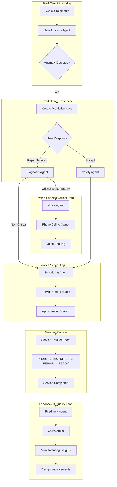

# 🚗 Project Prometheus - Agentic AI Predictive Maintenance System

An intelligent **EV predictive maintenance platform** powered by multi-agent AI orchestration, real-time telemetry analysis, voice-enabled critical alerts, and manufacturing feedback loops.


---

## 📋 Project Objectives

Project Prometheus addresses the complete predictive maintenance lifecycle for electric vehicles:

| # | Objective | Implementation |
|---|-----------|----------------|
| 1 | **Real-time Telemetry Analysis** | Continuously analyze sensor data using ML anomaly detection |
| 2 | **Predictive Failure Modeling** | Isolation Forest + failure risk prediction with days-to-failure estimation |
| 3 | **Proactive Voice Contact** | Voice Agent initiates calls for critical alerts (brake fade, battery critical) |
| 4 | **Service Demand Forecasting** | Historical pattern analysis to optimize service center workloads |
| 5 | **Intelligent Scheduling** | Coordinate service center availability with customer preferences |
| 6 | **Service Progress Tracking** | Amazon-style lifecycle tracking from INTAKE → PICKED_UP |
| 7 | **RCA/CAPA Analysis** | Cross-reference failures with manufacturing defect records for quality improvement |
| 8 | **UEBA Security** | Monitor agent interactions, detect anomalies, prevent unauthorized actions |

---

## 🤖 Multi-Agent AI Architecture

Project Prometheus employs a **LangGraph-based Master-Worker architecture** with 9 specialized AI agents that coordinate to deliver end-to-end predictive maintenance.

```
┌──────────────────────────────────────────────────────────────────────────────┐
│                         MASTER ORCHESTRATOR (LangGraph)                       │
│                    Coordinates all agents, manages state machine              │
│  ┌──────────────────────────────────────────────────────────────────────────┐ │
│  │                           UEBA SECURITY MONITOR                          │ │
│  │           Monitors all agent actions, detects anomalies                  │ │
│  └──────────────────────────────────────────────────────────────────────────┘ │
└──────────┬───────────────┬───────────────┬───────────────┬──────────────────┘
           │               │               │               │
     ┌─────▼─────┐   ┌─────▼─────┐   ┌─────▼─────┐   ┌─────▼─────┐
     │   DATA    │   │  SAFETY   │   │ DIAGNOSIS │   │SCHEDULING │
     │ ANALYSIS  │   │   AGENT   │   │   AGENT   │   │   AGENT   │
     │   AGENT   │   │           │   │           │   │           │
     └─────┬─────┘   └─────┬─────┘   └─────┬─────┘   └─────┬─────┘
           │               │               │               │
     ┌─────▼─────┐   ┌─────▼─────┐   ┌─────▼─────┐   ┌─────▼─────┐
     │   VOICE   │   │ SERVICE   │   │ FEEDBACK  │   │   CAPA    │
     │   AGENT   │   │ TRACKER   │   │   AGENT   │   │   AGENT   │
     │           │   │   AGENT   │   │           │   │           │
     └───────────┘   └───────────┘   └───────────┘   └───────────┘
           │                                               │
           └───────────────────────────────────────────────┘
                        Manufacturing Feedback Loop
```

### Agent Descriptions

| Agent | File | Responsibility |
|-------|------|----------------|
| **Master Orchestrator** | `orchestrator.py` | LangGraph workflow coordination, state management, agent routing, UEBA monitoring |
| **Data Analysis Agent** | `data_analysis_agent.py` | Real-time telemetry processing, ML anomaly detection, driver behavior scoring |
| **Safety Agent** | `safety_agent.py` | Precautionary advice, safe driving recommendations, immediate actions |
| **Diagnosis Agent** | `diagnosis_agent.py` | RAG-powered step-by-step diagnostics, root cause identification, repair recommendations |
| **Scheduling Agent** | `scheduling_agent.py` | Appointment booking, service center matching, demand forecasting |
| **Voice Agent** | `voice_agent.py` | Real-time voice calls for critical alerts, Web Speech API integration |
| **Service Tracker Agent** | `service_tracker_agent.py` | Amazon-style lifecycle tracking (INTAKE → PICKED_UP), ETA calculation |
| **Feedback Agent** | `feedback_agent.py` | Post-service feedback collection, sentiment analysis, NPS scoring |
| **CAPA Agent** | `capa_agent.py` | RCA/CAPA analysis, pattern detection, manufacturing quality feedback |

---

## 🔄 Agent Workflow & Coordination

### Complete Flow Diagram



### Workflow Stages

#### 1️⃣ **Telemetry Ingestion & Analysis**
```
Vehicle Sensors → WebSocket Stream → Data Analysis Agent → ML Pipeline
   ├── Isolation Forest (Anomaly Detection)
   ├── Failure Risk Prediction
   ├── Driver Behavior Scoring
   └── Component Health Monitoring
```

#### 2️⃣ **Prediction & Safety Response**
```
Anomaly Detected → Orchestrator Creates Prediction
   ├── User ACCEPTS → Safety Agent generates precautions (+points)
   ├── User REJECTS → Increment rejection count
   │   └── 3 rejections OR requires_service → Diagnosis Agent
   └── TIMEOUT (30s) → Auto-route to Diagnosis Agent
```

#### 3️⃣ **Critical Alert Voice Call**
```
Diagnosis Agent identifies critical brake/battery issue
   └── Orchestrator triggers → Voice Agent
       ├── Initiates phone call via Web Speech API
       ├── Explains safety situation
       ├── Offers immediate service appointment
       └── Books appointment via voice confirmation
```

#### 4️⃣ **Service Scheduling & Tracking**
```
Diagnosis Complete → Scheduling Agent
   ├── Query service center availability
   ├── Match specialist to component type
   ├── Check parts inventory
   └── Book optimal slot

Service Booked → Service Tracker Agent
   ├── INTAKE (vehicle received)
   ├── DIAGNOSIS (technician inspection)
   ├── WAITING_PARTS (if needed)
   ├── REPAIR (work in progress)
   ├── QUALITY_CHECK (verification)
   ├── READY (available for pickup)
   └── PICKED_UP (complete)
```

#### 5️⃣ **Feedback & Manufacturing Loop**
```
Service Complete → Feedback Agent
   ├── Collect customer rating (1-5 stars)
   ├── Analyze sentiment with LLM
   ├── Calculate NPS score
   └── Store in customer profile

Feedback Collected → CAPA Agent
   ├── Cross-reference with historical failures
   ├── Detect patterns (e.g., "50 vehicles in mountainous regions")
   ├── Generate RCA (Root Cause Analysis)
   ├── Create CAPA report
   └── Feed insights to manufacturing team
```

---

## 🔒 UEBA Security & Compliance

The **UEBAMonitor** class in `orchestrator.py` provides real-time monitoring of all agent activities:

```python
class UEBAMonitor:
    """User and Entity Behavior Analytics for agent monitoring."""
    
    ALLOWED_ACTIONS = {
        "data_analysis": ["analyze_telemetry", "score_driving", ...],
        "diagnosis": ["query_manual", "generate_diagnosis", ...],
        "scheduling": ["query_slots", "book_appointment", ...],
        ...
    }
    
    def log_action(self, agent: str, action: str, details: Dict)
    def _check_for_anomalies(self, entry: Dict)  # Detects unauthorized patterns
    def get_alerts(self)  # Returns security alerts
```

**Security Features:**
- Action whitelist enforcement per agent
- Unauthorized action detection
- Anomaly alerting for suspicious patterns
- Complete audit trail of all agent interactions

---

## 📚 RAG Knowledge Base

The `DiagnosticsRAG` class in `rag/knowledge_base.py` provides retrieval-augmented generation for expert diagnostics:

### Knowledge Sources

| Source | File | Purpose |
|--------|------|---------|
| **Vehicle Manuals** | `vehicle_manual.json` | OEM service procedures, specifications |
| **Industry Faults** | `industry_faults.json` | Common EV failure patterns, DTC codes |
| **CAPA Records** | `capa_records.json` | Historical root cause analyses, corrective actions |

### RAG Capabilities

```python
class DiagnosticsRAG:
    def query_manuals(symptom, vehicle_model)  # Search service procedures
    def find_similar_failures(anomaly_type)    # Match historical patterns
    def get_dtc_info(dtc_code)                 # Decode diagnostic trouble codes
    def get_rca_insights(failure_mode)         # Retrieve RCA documentation
    def semantic_search(query)                 # General knowledge retrieval
```

### How Agents Use RAG

1. **Diagnosis Agent** → Queries manuals for step-by-step repair procedures
2. **CAPA Agent** → Finds similar historical failures for pattern analysis
3. **Safety Agent** → Retrieves specific safety recommendations
4. **Chatbot** → Context-aware responses with expert knowledge

---

## 📊 Physics-Based Synthetic Data

Project Prometheus uses **physics-based simulation** for realistic telemetry generation, making our data industry-standard quality:

### Data Architecture

```
data/
├── datasets/
│   ├── vehicle_manual.json      # 50+ service procedures
│   ├── industry_faults.json     # 100+ fault patterns with DTC codes
│   └── capa_records.json        # 20+ detailed CAPA reports
├── vectordb/                    # ChromaDB embeddings
├── models/                      # Trained ML models per vehicle
└── Project Prometheus.db                  # SQLite (appointments, feedback)
```

### Synthetic Vehicle Data

| Data Type | Description | Physics Basis |
|-----------|-------------|---------------|
| **10 Example Vehicles** | VIN-001 to VIN-010 with unique profiles | Based on real EV specifications |
| **Sensor Readings** | Battery temp, motor temp, brake temp, SoC, etc. | Thermal models, degradation curves |
| **Usage Patterns** | Speed, acceleration, regen braking, elevation | Kinetic energy equations |
| **Maintenance History** | Past repairs, part replacements, service dates | Wear models |
| **Diagnostic Trouble Codes** | DTC patterns matching real EV codes | OBD-II / UDS protocols |

### Telematics Scenarios

| Scenario | Physics Model | What It Simulates |
|----------|--------------|-------------------|
| **Mountain Brake Fade** | Heat dissipation equations | Continuous downhill braking overheats friction brakes |
| **Battery Degradation** | Arrhenius aging model | High-temperature cycling accelerates cell degradation |
| **Thermal Runaway Risk** | Thermal cascade model | Battery cell imbalance leading to thermal event |
| **Regen Efficiency Loss** | Motor efficiency curves | Degraded regenerative braking performance |

### Data Quality Standards

- **Industry Datasets Integration**: Compatible with Kaggle, UCI Repository, HuggingFace automotive datasets
- **OEM-Aligned DTC Codes**: Based on SAE J2012 standard diagnostic codes
- **Physics-Validated Thresholds**: Critical limits match real EV specifications
- **Time-Series Realism**: Proper temporal correlation in telemetry streams

---

## 🏗️ System Architecture

```
┌─────────────────────────────────────────────────────────────────────────────┐
│                         FRONTEND (Next.js 16 + React 19)                     │
│  ┌──────────┐  ┌──────────┐  ┌──────────┐  ┌──────────┐  ┌──────────────┐  │
│  │Dashboard │  │ Vehicle  │  │ Chatbot  │  │ Service  │  │Manufacturing │  │
│  │  (Home)  │  │ Monitor  │  │  (AI)    │  │  Center  │  │  Dashboard   │  │
│  └────┬─────┘  └────┬─────┘  └────┬─────┘  └────┬─────┘  └──────┬───────┘  │
└───────┼─────────────┼─────────────┼─────────────┼───────────────┼──────────┘
        │ WebSocket   │    REST     │     REST    │    REST       │
┌───────┴─────────────┴─────────────┴─────────────┴───────────────┴──────────┐
│                        BACKEND (FastAPI + Uvicorn)                          │
│  ┌─────────────────────────────────────────────────────────────────────┐   │
│  │                 MASTER ORCHESTRATOR (LangGraph)                      │   │
│  │  ┌─────────┐ ┌─────────┐ ┌─────────┐ ┌─────────┐ ┌─────────────────┐│   │
│  │  │  Data   │ │ Safety  │ │Diagnosis│ │Scheduling│ │ Service Tracker ││   │
│  │  │ Analysis│ │  Agent  │ │  Agent  │ │  Agent   │ │     Agent       ││   │
│  │  └────┬────┘ └────┬────┘ └────┬────┘ └────┬────┘ └────────┬────────┘│   │
│  │  ┌────┴────┐ ┌────┴────┐ ┌────┴────┐ ┌────┴────┐ ┌────────┴────────┐│   │
│  │  │  Voice  │ │Feedback │ │  CAPA   │ │  UEBA   │ │  Agent State    ││   │
│  │  │  Agent  │ │  Agent  │ │  Agent  │ │ Monitor │ │  (LangGraph)    ││   │
│  │  └─────────┘ └─────────┘ └─────────┘ └─────────┘ └─────────────────┘│   │
│  └─────────────────────────────────────────────────────────────────────┘   │
│  ┌────────────────┐  ┌──────────────┐  ┌──────────────┐  ┌─────────────┐   │
│  │   ML Pipeline  │  │  RAG System  │  │   SQLite DB  │  │  ChromaDB   │   │
│  │ (Anomaly Det.) │  │ (Diagnostics)│  │(Appointments)│  │ (Vectors)   │   │
│  └────────────────┘  └──────────────┘  └──────────────┘  └─────────────┘   │
└─────────────────────────────────────────────────────────────────────────────┘
```

---

## 🚀 Quick Start

### Prerequisites
- Python 3.11+
- Node.js 18+
- Google Gemini API key

### 1. Clone & Setup

```bash
git clone https://github.com/your-repo/Project Prometheus.git
cd Project Prometheus

# Create virtual environment
python -m venv venv
source venv/bin/activate  # Windows: venv\Scripts\activate

# Install dependencies
pip install -r requirements.txt
```

### 2. Configure Environment

```bash
cp .env.example .env
# Edit .env with your GOOGLE_API_KEY
```

### 3. Build Knowledge Base (First Run)

```bash
python -m rag.knowledge_base --build
```

### 4. Start Backend

```bash
python -m ml.enhanced_api
```

### 5. Start Frontend

```bash
cd frontend
npm install
npm run dev
```

**Access:**
- Frontend: http://localhost:3000
- API Docs: http://localhost:8000/docs

---

## 🐳 Docker Deployment

```bash
# Development
docker-compose up --build

# Production (with nginx)
docker-compose --profile production up --build
```

---

## 📁 Project Structure

```
Project Prometheus/
├── agents/                      # AI Agents (9 total)
│   ├── orchestrator.py          # Master Orchestrator + UEBA Monitor
│   ├── data_analysis_agent.py   # Telemetry processing
│   ├── safety_agent.py          # Safety recommendations
│   ├── diagnosis_agent.py       # RAG-powered diagnostics
│   ├── scheduling_agent.py      # Appointment management
│   ├── voice_agent.py           # Voice call handling
│   ├── service_tracker_agent.py # Lifecycle tracking
│   ├── feedback_agent.py        # Customer feedback
│   ├── capa_agent.py            # RCA/CAPA analysis
│   └── agent_state.py           # LangGraph state definitions
├── ml/                          # Machine Learning
│   ├── enhanced_api.py          # FastAPI endpoints + WebSocket
│   ├── anomaly_detector.py      # Isolation Forest model
│   ├── telemetry_generator.py   # Physics-based simulation
│   └── scenarios.py             # Test scenario definitions
├── rag/                         # RAG Knowledge Base
│   └── knowledge_base.py        # ChromaDB + HuggingFace embeddings
├── db/                          # Database
│   └── database.py              # SQLite models
├── data/                        # Data Layer
│   ├── datasets/                # Knowledge sources (JSON)
│   ├── vectordb/                # ChromaDB persistence
│   └── models/                  # Trained ML models
├── frontend/                    # Next.js Application
├── docker-compose.yml           # Container orchestration
└── requirements.txt             # Python dependencies
```

---

## 🔌 API Reference

### REST Endpoints

| Method | Endpoint | Description |
|--------|----------|-------------|
| POST | `/api/v1/vehicles/{vin}/init` | Initialize vehicle with ML model |
| POST | `/api/v1/chat/{vehicle_id}` | Chatbot conversation |
| GET | `/api/v1/scheduling/{vehicle_id}/slots` | Available appointment slots |
| POST | `/api/v1/scheduling/{vehicle_id}/book` | Book appointment |
| GET | `/api/v1/service/{ticket_id}/status` | Service lifecycle status |
| GET | `/api/v1/capa/reports` | CAPA reports for manufacturing |

### WebSocket Endpoints

| Endpoint | Description |
|----------|-------------|
| `/api/v1/vehicles/{vin}/scenario-stream` | Real-time telemetry + predictions |

---

## 🛠️ Tech Stack

| Layer | Technologies |
|-------|--------------|
| **Backend** | FastAPI, Uvicorn, Python 3.11+ |
| **AI/ML** | LangChain, LangGraph, Google Gemini, scikit-learn |
| **Embeddings** | HuggingFace Transformers, Sentence-Transformers |
| **Vector DB** | ChromaDB |
| **Database** | SQLite (WAL mode) |
| **Frontend** | Next.js 16, React 19, TailwindCSS, Zustand |
| **Voice** | Web Speech API, gTTS |

---

## 📄 License

MIT License - See [LICENSE](LICENSE) for details.

---

## 🙏 Acknowledgments

Built for **EY Techathon 6.0** - Agentic AI Challenge

---

<p align="center">
  <b>Project Prometheus</b> - Where AI Meets Automotive Safety 🚗⚡
</p>
