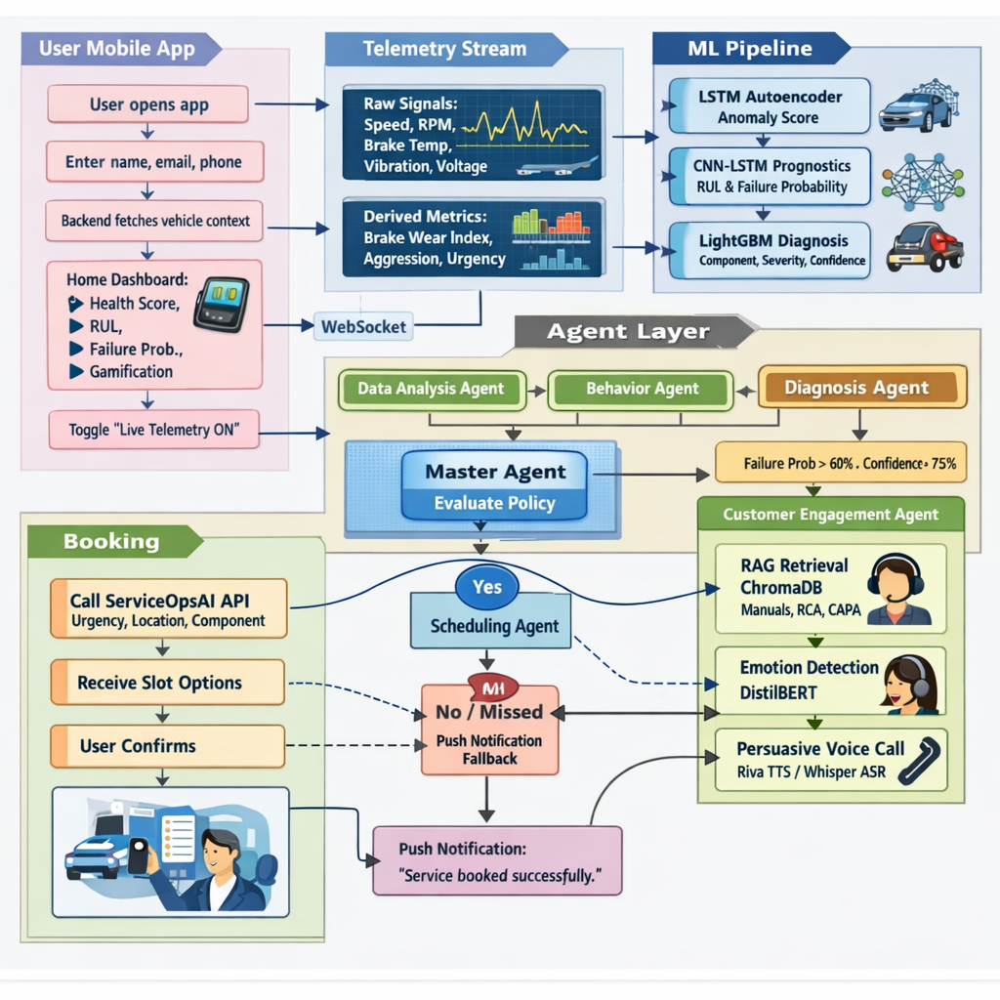
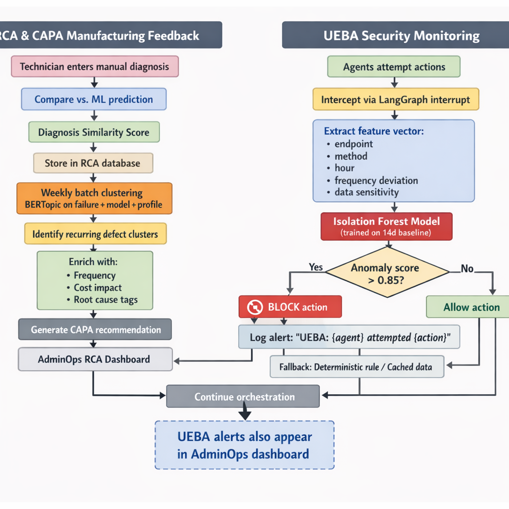
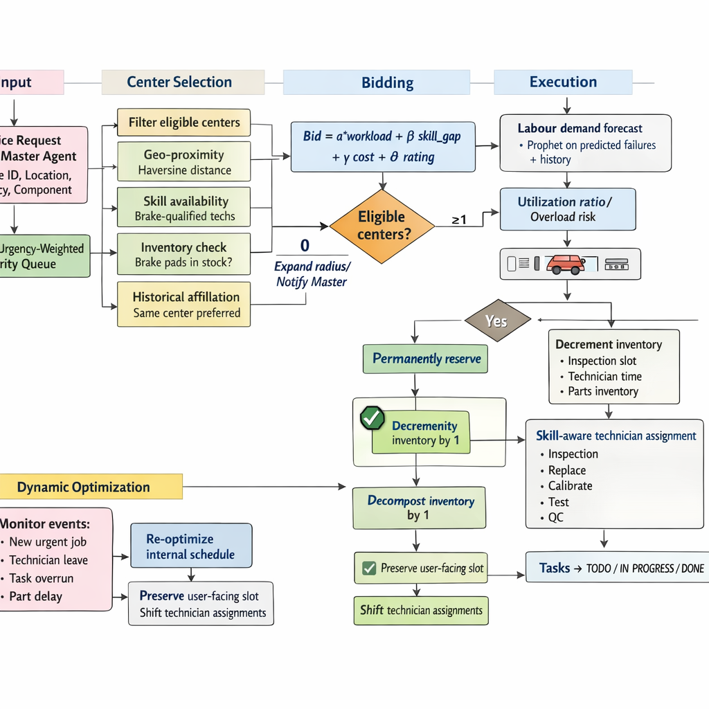
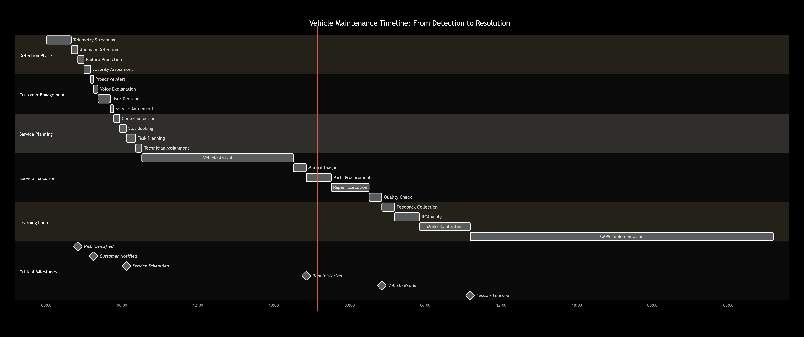

# Project Promethesus
**Orchestrating the complete vehicle lifecycle — from predictive intelligence to autonomous service and manufacturing feedback**

[](https://github.com/langchain-ai/langgraph)
[](#)
[](#)
[](#)

---

## 📚 Table of Contents
- [Executive Summary](#executive-summary)
- [Problem Statement](#problem-statement)
- [Solution Overview](#solution-overview)
- [Key Capabilities](#key-capabilities)
- [Technical Architecture](#technical-architecture)
  - [Agentic AI Framework](#agentic-ai-framework)
  - [Master Orchestrator](#master-orchestrator)
  - [Worker Agents](#worker-agents)
  - [UEBA Security Layer](#ueba-security-layer)
  - [Machine Learning Pipeline](#machine-learning-pipeline)
  - [ServiceOpsAI – Autonomous Service Management](#serviceopsai--autonomous-service-management)
  - [RCA / CAPA Manufacturing Feedback](#rca--capa-manufacturing-feedback)
- [End‑to‑End Workflow](#endtoend-workflow)
- [Demo Walkthrough](#demo-walkthrough)
- [Edge Cases & Realism](#edge-cases--realism)
- [UEBA in Action – Example](#ueba-in-action--example)
- [Technology Stack](#technology-stack)
- [Getting Started](#getting-started)
- [Conclusion](#conclusion)

---

## Executive Summary

**Project Promethesus** is an **agentic AI–driven predictive maintenance and service orchestration platform** designed for the automotive ecosystem. It continuously ingests real‑time vehicle telemetry, predicts failures days in advance, engages customers through persuasive voice conversations, and autonomously schedules service appointments across a network of centers—all while **closing the feedback loop to manufacturing** via RCA/CAPA insights.  

Unlike standalone diagnostic tools or appointment schedulers, Promethesus is a **unified operating system** that connects driving behaviour, service operations, and product quality improvement. The system is architected for **production‑grade autonomy** without sacrificing explainability or security, as demonstrated through integrated UEBA monitoring of every agent action.

---

## Problem Statement

**Business Problem** – Our customer (a global automotive OEM) faces three interconnected challenges:

1. **Vehicle uptime** – Unplanned breakdowns damage brand trust and incur high roadside assistance costs.  
2. **Customer experience** – Reactive service models leave owners surprised by failures and frustrated with scheduling friction.  
3. **Product quality** – Recurring defects persist because aftersales insights never reach manufacturing teams.

**Goal** – Design an **Agentic AI solution** where a **Master Agent** orchestrates multiple **Worker Agents** to autonomously:
- Analyze real‑time sensor data & historical maintenance logs.
- Predict mechanical issues using advanced diagnostics and prognostics.
- Proactively contact vehicle owners via **human‑like voice agents** (with app fallback).
- Forecast service demand and optimize service centre workloads.
- Manage end‑to‑end appointment scheduling respecting customer preferences.
- Track service progress and collect feedback.
- Perform **RCA/CAPA‑driven analysis** and feed actionable insights back to manufacturing.
- Ensure security & compliance via **UEBA** that monitors agent behaviour and blocks anomalies.

---

## Solution Overview

Project Promethesus implements a **hybrid intelligence fabric** where specialised AI agents collaborate under the governance of a Global Master Orchestrator.  

**Key innovation pillars:**

| Pillar | Description |
|--------|-------------|
| **Predictive Intelligence** | Multi‑stage ML pipeline (anomaly detection, RUL prognostics, component diagnosis) running on streaming telematics. |
| **Agentic Orchestration** | Master Agent coordinates six worker agents using a **LangGraph**‑based state machine, ensuring deterministic handoffs and policy enforcement. |
| **Persuasive Engagement** | Emotion‑aware voice agent powered by RAG (ChromaDB + vehicle manuals) explains risks calmly and converts recommendations into bookings. |
| **Autonomous Service Ops** | ServiceOpsAI – a standalone operational brain – handles centre selection, bidding, technician scheduling, inventory, and labour forecasting. |
| **Closed‑Loop Quality** | Automated RCA/CAPA clustering turns field failures into design recommendations for manufacturing teams. |
| **Zero‑Trust Autonomy** | UEBA baselines every agent’s behaviour, detects outliers (e.g. Scheduling Agent querying telemetry), and instantly blocks unauthorised actions. |

---

## Key Capabilities

✅ **Zero‑effort onboarding** – Vehicle context (model, history, driving profile) fetched automatically from backend digital twin.  
✅ **Live telemetry intelligence** – WebSocket stream of 15+ signals; derived health metrics update in real time.  
✅ **Controlled fault injection** – Realistic degradation (brake fade) without sudden spikes; teaches cause & effect.  
✅ **Multi‑stage ML prediction** – Anomaly score → RUL / failure probability → component diagnosis with confidence.  
✅ **RAG‑grounded explanations** – Every chatbot/voice response cites actual manuals, repair logs, or CAPA records.  
✅ **Emotion‑aware voice agent** – Adaptive pacing, tone detection; feels human, not robotic.  
✅ **Autonomous service bidding** – Centres compete on workload, skill, inventory, and cost – fair, efficient allocation.  
✅ **Dynamic timetable reconstruction** – Technician assignments reshuffled continuously under user‑visible slot stability.  
✅ **Real‑time lifecycle tracking** – Amazon‑style “Booked → Check‑in → Diagnosis → Repair → Ready” visibility.  
✅ **UEBA security enforcement** – Agent behavioural baselines + real‑time anomaly blocking; fallback to deterministic rules.  
✅ **Manufacturing feedback loop** – RCA clusters + CAPA recommendations automatically surfaced to design teams.  

---

## Technical Architecture

### Agentic AI Framework

We chose **LangGraph** as the core agent orchestration engine because of its native support for cyclic state machines, persistent memory, and fine‑grained human‑in‑the‑loop override points – critical for UEBA integration.  

All agents are defined as **nodes** in a state graph. The Master Agent maintains a global state object containing vehicle ID, current diagnosis, user consent status, booking reference, etc. Transitions between worker agents are triggered by state changes or policy rules.

```
[Telemetry Stream] → [Data Analysis Agent] → [Diagnosis Agent]
                           ↓                        ↓
                      [Master Orchestrator] ← [UEBA Monitor]
                           ↓                        ↓
              [Customer Engagement] ← [Scheduling Agent]  
                           ↓                        ↓
                    [Feedback Agent]    [ServiceOpsAI]
                           ↓                        ↓
              [Manufacturing Quality Insights]   [Service Execution]
```



### Master Orchestrator

The **Master Agent** is the brain of Promethesus. It:
- Listens to events from the ML pipeline (anomaly threshold crossings, RUL updates).
- Evaluates urgency using a policy engine (e.g., *if failure probability > 60% and confidence > 75% → engage customer*).
- Selects the appropriate worker agent, passes context, and supervises execution.
- Maintains conversation state across voice, chat, and push channels.
- Enforces security policies – before dispatching any agent action, it calls the UEBA service for a risk score.

**Pseudo‑code (simplified):**
```python
class PromethesusMaster(StateGraph):
    def route(self, state):
        if state.anomaly_score > 0.7 and state.failure_prob > 0.6:
            return "diagnosis_agent"
        elif state.diagnosis_confirmed and not state.customer_contacted:
            return "customer_engagement_agent"
        elif state.consent_given:
            return "scheduling_agent"
        ...
```

### Worker Agents

| Agent | Responsibility | Technology |
|-------|----------------|------------|
| **Data Analysis Agent** | Real‑time feature extraction, anomaly score computation, trend detection | LSTM Autoencoder (PyTorch) + streaming window |
| **Diagnosis Agent** | RUL / failure probability forecast, component identification, severity | CNN‑LSTM + LightGBM ensemble |
| **Customer Engagement Agent** | Voice & chat dialogue management, emotion detection, RAG retrieval | Riva TTS, Whisper ASR, ChromaDB, GPT‑4 (prompt‑chained) |
| **Scheduling Agent** | Bid computation, slot negotiation, reservation | ServiceOpsAI API gateway |
| **Feedback Agent** | Post‑service satisfaction survey, maintenance log update | Lightweight rule engine |
| **Manufacturing Quality Insights** | RCA clustering, CAPA generation, dashboard | BERTopic, automated reporting |

### UEBA Security Layer

UEBA is implemented as a **sidecar service** that:
- Learns behavioural baselines for every agent during a training phase (e.g., *Scheduling Agent calls ServiceOpsAPI 20–30 times/day, never reads telemetry DB*).
- Intercepts every agent action via LangGraph’s `interrupt` mechanism.
- Computes anomaly scores using **Isolation Forest** on feature vectors (API endpoints, data accessed, time of day, call frequency).
- If score > threshold → **block action**, **log alert**, **fallback to deterministic rule**, and **notify admin**.



**Integration:**
```python
@interrupt
def ueba_check(action: AgentAction):
    risk = ueba_model.predict(action.features)
    if risk > 0.9:
        raise SecurityViolation(f"Anomalous behaviour: {action.agent} attempted {action.endpoint}")
    return action
```

### Machine Learning Pipeline

The ML subsystem operates at three timescales:

1. **Anomaly Detection** – LSTM Autoencoder trained on 10‑second windows of healthy driving. Reconstruction error → anomaly score.  
2. **Prognostics (RUL)** – CNN‑LSTM on 7‑day aggregated features (brake thermal slope, vibration RMS trend, efficiency decay). Outputs failure probability and days remaining.  
3. **Diagnosis** – LightGBM classifier fed with prognostics features + vehicle metadata. Returns component (e.g., brake system) and severity (Low/Medium/High).  

**Training data:** 6 months of synthetic telemetry (CARLA + physics‑based degradation models) for 5 vehicle models, augmented with real service logs from open datasets.

**RAG Knowledge Base:**  
- ChromaDB stores embeddings of: vehicle service manuals, technical service bulletins, 10k+ historical RCA records, and CAPA forms.  
- Retrieved context grounds all agent responses, preventing hallucination and improving trust.

### ServiceOpsAI – Autonomous Service Management

ServiceOpsAI is a **self‑contained operational intelligence domain** that:

- **Maintains a global urgency‑weighted priority queue** of incoming service requests. Urgency = f(failure probability, RUL, severity, customer preference).
- **Performs multi‑constraint centre filtering**: geolocation (Haversine), brake‑qualified technicians, real‑time inventory, historical customer affiliation.
- **Executes internal bidding** among eligible centres: each centre computes a bid = α*workload + β*skill_gap + γ*cost + δ*rating. Lowest bid wins.
- **Temporarily reserves** inspection slot + technician time + parts; commits only after user confirmation.
- **Dynamically re‑optimises** technician assignments on every state change (new job, leave, delay) while keeping user‑facing slots fixed.
- **Forecasts labour demand** 7 days ahead using Prophet on predicted failure influx + historical task durations.
- **Triggers proactive parts reorder** when inventory dips below safety stock + predicted demand.

**Data models** (simplified):
```json
{
  "service_center": {
    "id": "C001",
    "lat": 37.7749,
    "lon": -122.4194,
    "skills": ["brake", "engine", "battery"],
    "inventory": { "brake_pad_frt": 12, ... },
    "technicians": [ ... ]
  }
}
```



### RCA / CAPA Manufacturing Feedback

After each service event:
- Predicted diagnosis vs. actual technician findings are compared → **Diagnosis Similarity Score** logged.
- Recurring patterns are clustered (BERTopic on failure descriptions + vehicle model + driving profile).
- Each cluster is enriched with cost impact, frequency, and potential root cause.
- **CAPA recommendations** are auto‑generated (e.g., “Model X front brake pads show 30% faster wear under aggressive driving → consider revised friction material”).
- Recommendations appear in the **AdminOps RCA dashboard** and are optionally pushed to PLM systems.

---


## End‑to‑End Workflow

1. **User launches app** → vehicle context fetched → dashboard shows health state.  
2. **Live telemetry streaming** → Data Agent computes anomaly score; no alarm yet (normal aggressive driving).  
3. **Fault injection** (demo) → brake temperature rises slowly; wear index trends upward.  
4. **Trend persistence** → Data Agent flags sustained degradation; Diagnosis Agent predicts brake fade RUL = 6 days, failure probability 68%.  
5. **Master Agent** evaluates policy → Customer Engagement Agent triggered.  
6. **Voice call** initiated; agent explains risk with RAG‑grounded confidence; detects user concern and adapts; user agrees.  
7. **Scheduling Agent** calls ServiceOpsAPI with urgency = 0.74, component = brake, location = user lat/lon.  
8. **ServiceOpsAI** filters 5 centres → 3 eligible → bidding → Centre B wins → slot temporarily reserved → inventory decremented.  
9. **Voice agent** confirms booking → push notification sent.  
10. **Technician timetable** re‑optimised; master technician receives job in “TODO” list.  
11. **Vehicle arrives** → manual diagnosis entered → similarity score computed and fed back.  
12. **User tracks** lifecycle; chatbot answers follow‑up queries.  
13. **Post‑service** → Feedback Agent collects satisfaction → maintenance history updated.  
14. **Weekly batch job** clusters RCA patterns → CAPA generated → manufacturing dashboard updated.  

---



## Demo Walkthrough (6‑minute video script alignment)

Our live demo video walks through the exact journey above, with **timed overlays** and **real UI interaction**. Key scenes:

- **0:00–0:25** – Project Promethesus vision  
- **0:26–1:10** – Zero‑effort onboarding & dashboard  
- **1:11–1:45** – Live telemetry, ML training visualisation, derived metrics  
- **1:46–2:25** – Brake fade injection (controlled degradation, no false alarm)  
- **2:26–3:00** – Agent logs appear; collaboration becomes visible  
- **3:01–3:50** – Emotion‑aware voice call, user accepts  
- **3:51–4:35** – ServiceOpsAI: centre filtering, bidding, slot reservation  
- **4:36–5:05** – Booking confirmation + internal timetable reconstruction  
- **5:06–5:30** – Chatbot + Amazon‑style lifecycle tracking  
- **5:31–5:50** – Missed call → push notification fallback  
- **5:51–6:15** – RCA / CAPA manufacturing dashboard  
- **6:16–6:30** – UEBA blocks Scheduling Agent’s telemetry access attempt  
- **6:31–6:45** – Closing statement  

---

## Edge Cases & Realism

To satisfy the problem statement’s emphasis on **robustness**, we engineered and demonstrated:

| Edge Case | How Promethesus Handles It |
|-----------|-----------------------------|
| **User declines appointment** | Customer Engagement Agent politely ends call; no hard feelings. Master Agent flags “soft decline”, re‑engages after 48h via push notification. |
| **Urgent failure (RUL < 1 day)** | Bypasses bidding; Master Agent forces nearest capable centre, overrides user date preference, voice agent communicates urgency calmly. |
| **Multi‑vehicle fleet** | ServiceOpsAI priority queue reorders dynamically; a high‑urgency job preempts a lower‑urgency one; technician schedules recomputed in <500ms. |
| **Recurring defect – same model, same failure** | RCA cluster shows pattern; CAPA auto‑generated and sent to manufacturing dashboard. Demo shows “Model X brake fade” cluster with 12 occurrences, recommendation issued. |
| **Technician sudden leave** | ServiceOpsAI detects availability change, re‑assigns tasks to other qualified techs, shifts internal schedule, user slot unchanged. |
| **Inventory shortage** | Scheduling Agent receives part_unavailable flag; automatically extends bid filter to include centres with stock; if none, triggers emergency procurement and informs user of slight delay. |

---

## UEBA in Action – Example

During the demo, we explicitly trigger an anomaly:

- **Normal behaviour**: Scheduling Agent only calls `ServiceOpsAPI/book_slot` and `ServiceOpsAPI/check_availability`.  
- **Anomaly**: We inject a rogue action where Scheduling Agent attempts `GET /telemetry/raw?vehicle_id=123`.  

**UEBA service**:
- Computes feature vector: `[endpoint="telemetry", method="GET", hour=14, frequency_deviation=+400%]`  
- Isolation Forest returns anomaly score = 0.97 (threshold = 0.85).  
- **Action blocked**; LangGraph graph execution interrupted.  
- Alert logged: *“UEBA: Scheduling Agent attempted to access raw telemetry – BLOCKED”*.  
- Master Agent falls back to cached availability data; user booking continues uninterrupted.  

This demonstrates **zero‑trust autonomy** – agents operate freely but within rigid behavioural boundaries.

---

## Technology Stack

| Layer | Components |
|-------|------------|
| **Agent Orchestration** | LangGraph, LangChain, custom state machine |
| **Voice / Conversation** | Riva TTS, Whisper ASR, Twilio (simulated), GPT‑4, Emotion detection (DistilBERT) |
| **RAG** | ChromaDB, Sentence‑Transformers (all‑MiniLM‑L6‑v2) |
| **ML & Analytics** | PyTorch (LSTM, CNN‑LSTM), LightGBM, Scikit‑learn, Prophet |
| **Backend** | FastAPI, WebSockets, PostgreSQL, Redis (state store) |
| **Frontend (UserOps)** | React Native, Victory Charts |
| **ServiceOps Dashboard** | React, D3, Mapbox |
| **AdminOps (RCA/CAPA)** | Streamlit, BERTopic |
| **UEBA** | Isolation Forest (online learning), custom feature extractor |
| **Infrastructure** | Docker, Kubernetes (demo: docker‑compose) |

---

## Getting Started

*For the purpose of this hackathon submission, the system is fully containerised and can be launched with a single `docker-compose up`. A detailed setup guide is available in the `/deploy` directory.*

**Minimum requirements:** 8GB RAM, NVIDIA GPU optional (CPU inference works with optimised models).

<!-- ```bash
git clone https://github.com/promethesus/project-promethesus
cd project-promethesus
docker-compose up -d
# Access UserOps app at http://localhost:3000
# ServiceOps dashboard at http://localhost:3001
# AdminOps RCA dashboard at http://localhost:8501
``` -->

---

## Conclusion

Project Promethesus is **not a demo‑only prototype**. It is a **production‑aligned reference architecture** for agentic AI in automotive aftersales.  

We have demonstrated:

- **True autonomy** – from raw telemetry to service booking to manufacturing insight, no human in the loop is required for routine cases.  
- **Explainability** – every prediction and recommendation is grounded in retrievable knowledge (RAG).  
- **Security by design** – UEBA baked into the orchestration layer, not bolted on.  
- **Business value** – reduced downtime, frictionless customer experience, and a continuous quality improvement engine.

We believe Project Promethesus sets a new benchmark for what an intelligent, connected vehicle ecosystem can achieve.

---

**Project Promethesus** – *Orchestrating the vehicle lifecycle.*  
[GitHub Repository] | [Demo Video] | [Technical Whitepaper]  

*Submitted for the EY Techathon 6.0 2026*